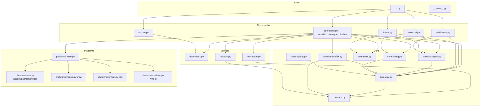
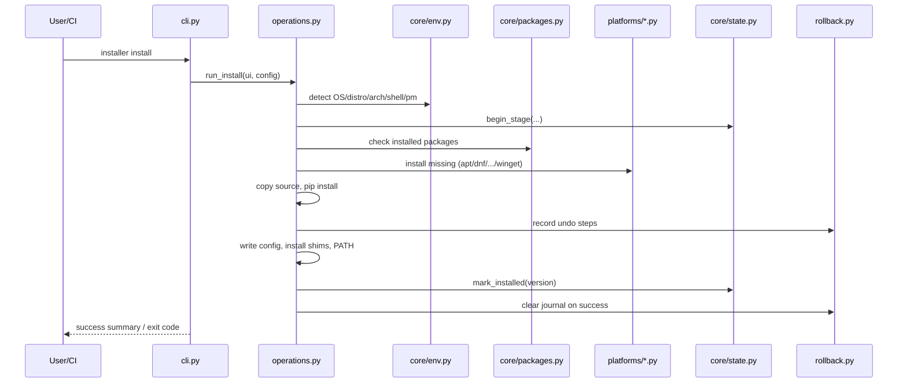

# Architecture

The installer is a dependency-free Python package (stdlib only) so it can run
on a bare machine. It is split into a stable *core*, swappable *platform
backends*, and thin *service modules* layered on top.

## Module map

## Data flow during `installer install`

On failure in a critical stage, `rollback.rollback()` replays undo steps in
reverse (uninstall packages, delete created files, restore overwritten config),
leaving the machine as close to its previous state as possible.

## Key design decisions

- **Dependency-free bootstrap.** The installer cannot assume pip, yt-dlp or
  even a fully populated PATH, so everything uses the standard library.
- **Logical package abstraction.** Code names tools (`git`, `ffmpeg`), not
  packages. `core/packages.py` + `packages.yaml` resolve to per-manager names,
  so a new distro or manager is a backend + a mapping, not a rewrite.
- **State machine with repair.** `core/state.py` records each stage's status.
  `installer repair` re-runs only failed/incomplete stages.
- **Idempotency everywhere.** Shell-profile edits, downloads, config writes and
  re-installs never duplicate work.
- **Least privilege.** Root/`sudo` only used when a privileged manager needs
  it, never for the whole install; `sudo -n` in non-interactive mode.
- **Config wins.** User config merges over defaults; `installer config` edits
  live JSON (or YAML/TOML by extension).

## Extensibility

- *New tool* → add an entry to `packages.yaml` (see `docs/packages.md`).
- *New package manager* → implement the four primitives
  (`install`, `remove`, `update`, `error_hint`) on `platforms/base.py` and
  register it in `platforms/__init__.py`.
- *New platform* → create a `platforms/<name>.py` backend and teach
  `core/env.py` to detect it.
